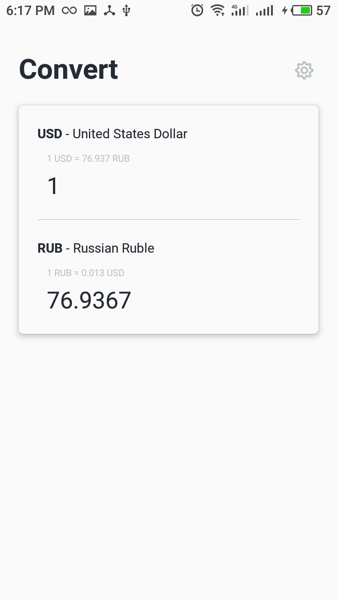
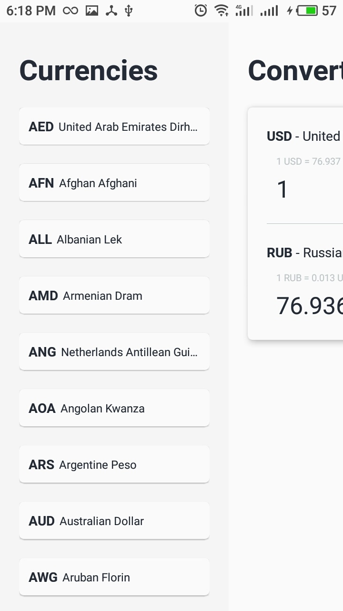
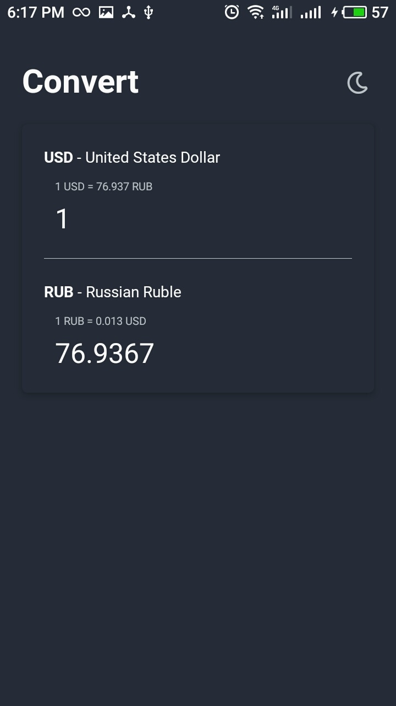
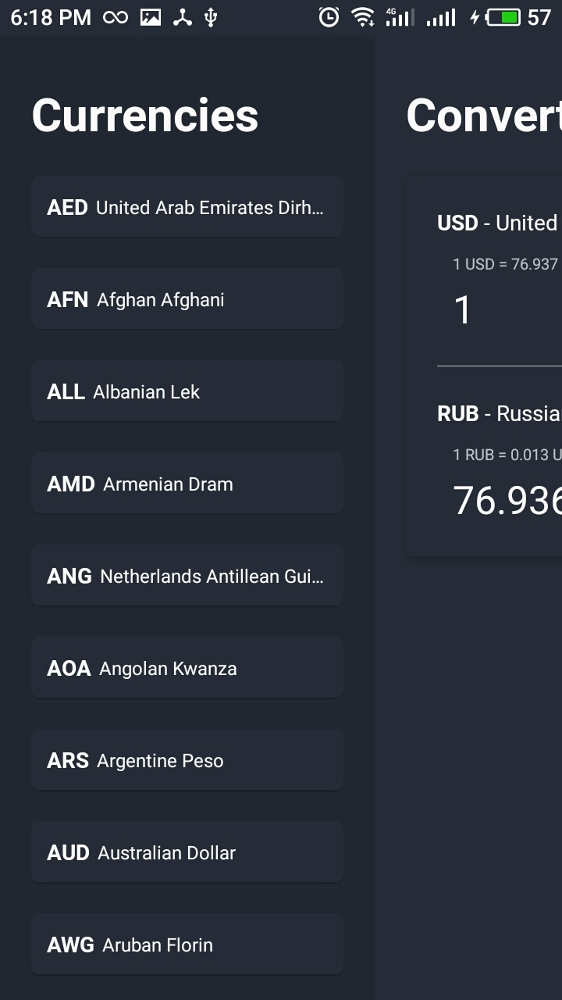

# react-native-currency-exchanger
💱 Application for exchanging currencies using React Native + Redux + Redux Thunk + TypeScript (in progress)

## Project setup
```
npm install
```

### Compiles and hot-reloads for development
```
npm run start
```

## Images
<div style="display: flex; margin: 20px 0">
  

  
</div>

<div style="display: flex">
  

  
</div>
